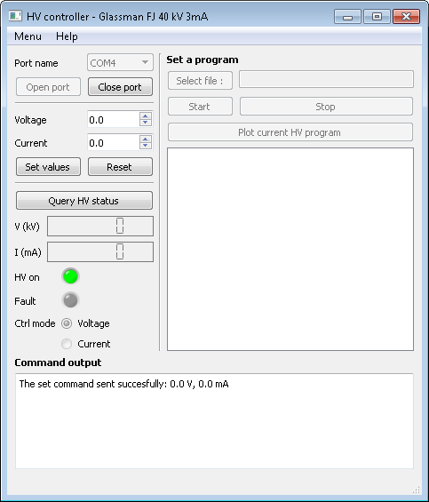

===============================================
HvControllerGUI
===============================================
|zenodo-doi| 

.. |zenodo-doi| image::  https://zenodo.org/badge/DOI/10.5281/zenodo.2613605.svg
    :target: https://doi.org/10.5281/zenodo.2613605
    :alt: DOI

HvControllerGUI is a graphical application to control a Glassman HV power supply. It has been developed for a FJ series model, delivering positive high voltage up to 40 kV  and 3 mA (model FJ40P03).

Installation
============

Clone the repository to get a copy of the source code:

.. code-block:: bash

    git clone https://github.com/avancra/HvControllerGUI.git
    python HvControllerGUI.py

License
=======

HvControllerGUI is licensed under the Apache License, Version 2.0 (see LICENSE for full version of the license)

Citation
========

If you used this software please acknowledge its author(s):

Default citation format:

*Aurélie Vancraeyenest. (2019, March 28). HvControllerGUI - Instrument control software for High Voltage power supply (Version v1.0). Zenodo. http://doi.org/10.5281/zenodo.2613605*

For citation format, you can either use the one below, or go to `the project publication page <https://doi.org/10.5281/zenodo.2613605>`_ to get other citation export options.

Features
========
The HV module is accessed through a serial port. Once the port open, it is possible to set high voltage to the desired value. 

The reset button allows to set the HV back to 0 kV and the HV off, but do not close the serial port.

A query button allows to make a direct query to the HV device, which will output the HV voltage and current as well as the status (on, off), the mode (voltage, current) and the fault status in text format to the Command output. A query to the device is in any case performed every 500 ms as the device as a communication timeout of 1.5 s. 

.. Note::
    The right hand side panel for a pre-defined HV program is not currently available.

During the acquisition, the stability of the supplied voltage is checked every minute to ensure that it does not diverge from more than 0.2 kV from the target value. An entry log to a *hvCtrl.log* file is made each time the HV value deviate too much, and every 10 min otherwise.

Software details
================

Design
------

The graphical interface has been designed using QtDesigner and PyQt5. Therefore any modifications to the interface should be done through QtDesigner and then exported to python using the :code:`pyuic5` command.

The software makes a great use of PyQt signal and slot mechanism to communicate between different threads and keep the GUI responsive. The connecting slot by name convention has been used whenever possible. The software makes also extensive use of the *@PyQt.Slot()* decorator.

Threading is done using QRunnables and a QThreadPool to allow small repetitive actions. QTimers are also used for the query and the stability check.

Components
----------

**HvControllerGUI** contains the main GUI application with all the GUI logic for signal and slots as well as some GUI design. Most of the GUI design is nevertheless defined in the **HvGUI.ui/py** files. The **resources** files contains definitions of the visual resources used in the program.

In the **HvController** class are defined all the methods for communication with the hardware. Some hardware characteristics are defined as class variables and can be adapted for other hardware(MAX_VOLTAGE, MAX_CURENT, MAX_HEX_VAL_RECEIVE, MAX_HEX_VAL_SENT).

The thread workers are defined in the **workers.py** file and the **checksum module** import some functionalities to deal with checksum calculation and checking. The thread worker is designed to be very generic. It takes a function name as argument and its arguments as keyword arguments. This allow to launch all the small functions through the same worker.

